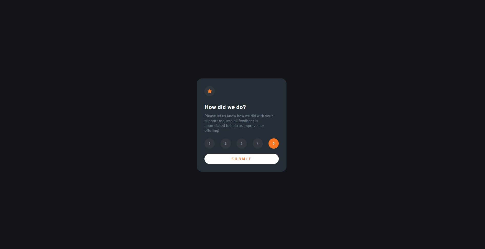
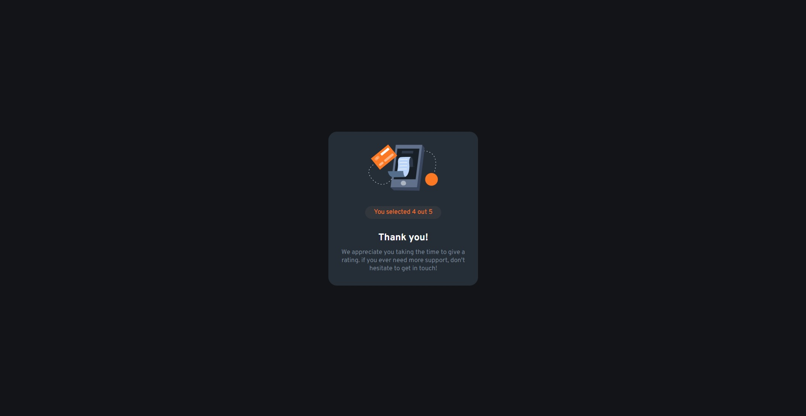
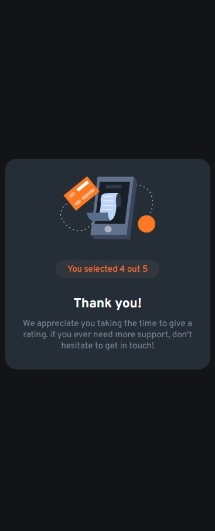

# Make-It-Real---Interactive-rating-component
MakeItReal - Octubre 21 del 2022

## Tabla de contenido

- [Taller](#Taller)
- [Resultado](#Resultado)
- [Recursos](#Recursos)
    - [Caracteristicas](#Caracteristicas)
- [Conclusiones](#Conclusiones)
## Taller
    Realizar una pagina 404 NOT FOUND segun las caracteristicas y especificaciones propuestas.

    [Taller01](https://github.com/makeitrealcamp/top-v25/tree/main/challenges/interactive-rating)

## Resultado (Desktop & Mobile)

> Desktop

> Desktop card Thanks!

> Mobile

## Recursos

Se realizo con las tecnologias:
    - Html
    - Css

La imagen fue suministrada y las caracteristicas son las siguientes:

### Caracteristicas

    Guia de Estilo:

    - Mobile: 375px
    - Desktop: 1440px

    Colores:

    Primary
    - Orange: hsl(25, 97%, 53%)

    Neutral
    - White: hsl(0, 0%, 100%)
    - Light Grey: hsl(217, 12%, 63%)
    - Medium Grey: hsl(216, 12%, 54%)
    - Dark Blue: hsl(213, 19%, 18%)
    - Very Dark Blue: hsl(216, 12%, 8%)

    Tipografia:

    - Family: [Overpass](https://fonts.google.com/specimen/Overpass)
    - Weights: 400, 700
    - Font size: 15px

## Conclusiones

Aplicamos hover y focus en nuestros diseños de tarjetas.
